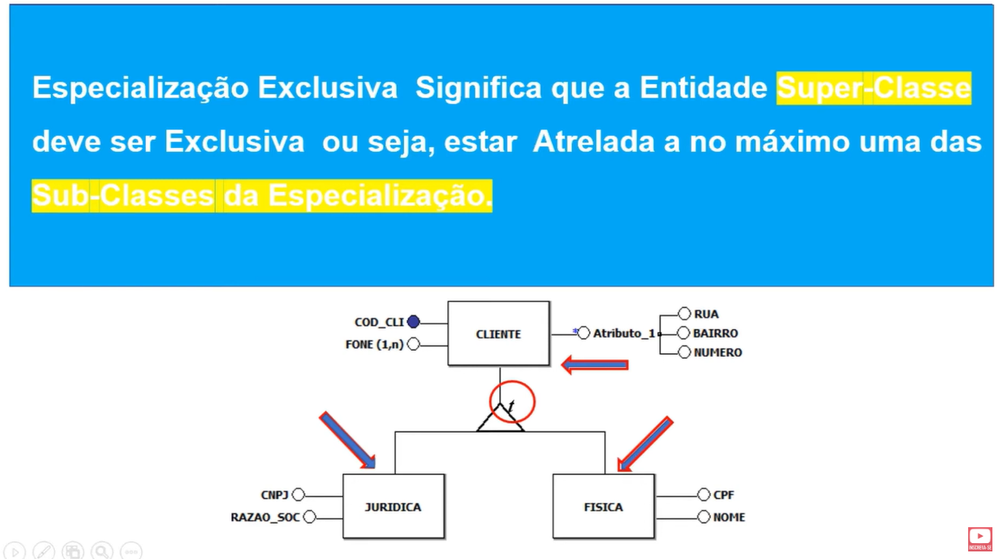
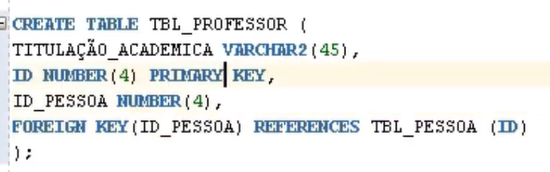

# Tipos de Especialização

## Parcial (p)
- Uma entidade na super-classe não precisa estar necessariamente atrelada a pelo menos uma das sub-classes da especialização.
- Podem ter funcionário que não é nem engenheiro nem motorista, pode isso existe um atributo chamado cargo, na entidade funcionário

    

## Total (t)
- Toda entidade da super-classe pai precisa estar associada a pelo menos uma entidade da subclasse filha
- Para cada ocorrencia na entiedade generica existe uma ocorrencia nas entidades especializadas
- Sempre quando for cadastrado um cliente, deverá ser cadastrado ou uma pessoa física ou uma 
  

## Exclusiva
- A super classe precisa esta associada a apenas uma subclasse
- A entidade super-classe deve estar atrelada a no máximo uma das sub-classes da especialização
  

## Não exclusiva
- Um registro na entidade generica pode aparecer em diversas especializações
- Uma pessoa pode ser:
  -  professor
  -  funcionário
  -  aluno
  -  professor e funcionário
  -  funcionário e aluno
  -  professor e aluno
  -  professor, funcionário e aluno. 
- 

# Nível lógico
- Especialização total

    
    

- Especialização total exclusiva
    
    
    

    
    
    
    
- Especialização parcial não exclusivo

    
    

    
    

    
    
    
    

- Especialização parcial

    

     ->gera atributos nulos

    